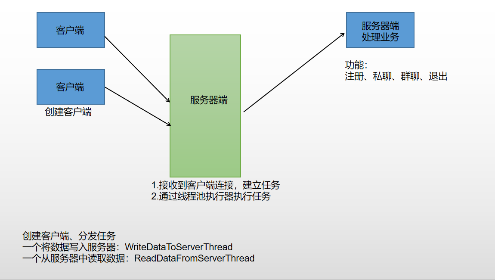

##项目名称：网络聊天室

##项目描述：支持注册、群聊、私聊的网络聊天室

##实用技术：Java基础，Socket编程，多线程

##项目功能：
+ 支持注册、群聊、私聊、退出

##项目实现：

+ 服务端：采用线程池调度执行服务器与客户端业务处理逻辑
   
+ 客户端：采用读写线程，分别处理交互与服务器数据连接
##项目总结
+ 加深了Maven工具的理解和掌握
+ 提升了多线程的优点的认识与熟练使用
+ 熟悉项目的开发流程，进一步加深了编写测试用例的方法
+ 掌握了项目测试的流程。
##优化与扩展
###优化点
+ 参数校验
+ 异常信息处理
+ 用户体验（信息展示）
###扩展点
+ 数据存储到存储引擎（MySQL）
+ 注册信息存储
+ 增加登录功能（用户名+密码）
+ 历史消息存储